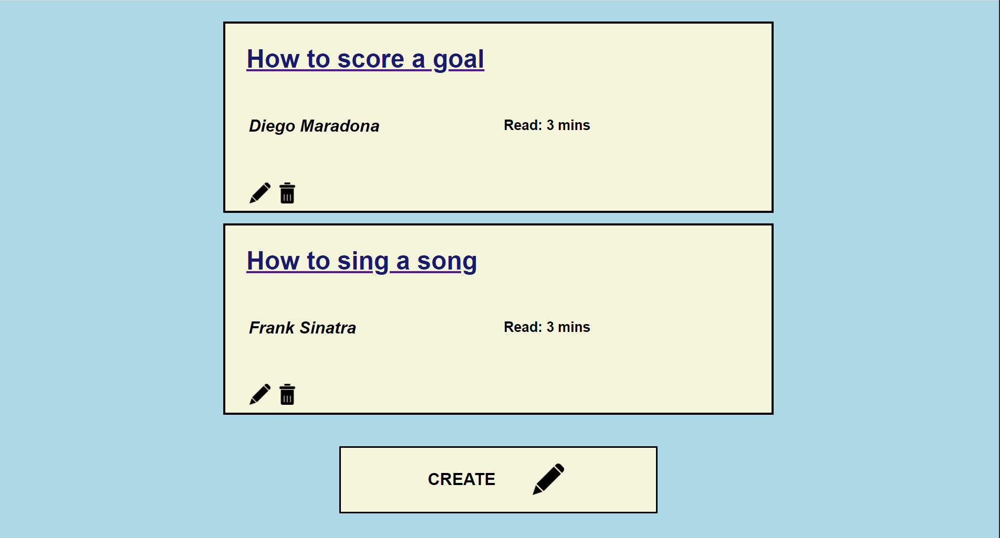
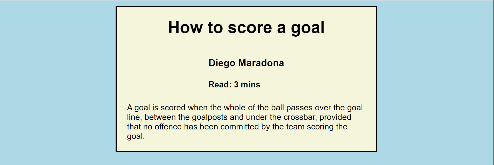

# Django-CRUD-Blog
[](https://pypi.org/project/socceraction)
[](https://opensource.org/licenses/MPL-2.0)
[](https://travis-ci.org/ML-KULeuven/socceraction)

A Django project implementing CRUD operations on a blog site.

This project aims to create a basic django framework for the 4 standard database operations- Create, Retrieve, Update and Delete. In addition to setting up the Django framework and functions, this project includes the HTML files used to interact with the Python objects and a minimalistic style using CSS.

The basic operations can be used to form a fully functioning blog website with full customisation on the HTML pages and the styling with CSS.

To use this project as the basis for your own project, simply clone the repository and install the required packages in your environment. You can then freely edit files and functions to build on your own.

To view the current files and webpages, clone the repository and install the required packages found in requirements.txt in your environment. In the base directory run

```sh
python manage.py runserver
```
This command should be familiar to those who have worked with Django's web framework before. Navigate to the host/blogapp/ to see the homepage for the blog CRUD application.



